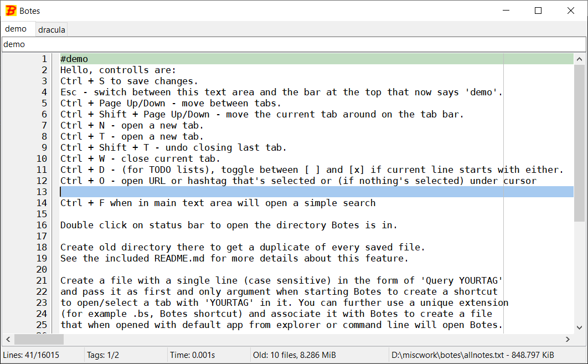

# Botes
`Botes` is a simple notes keeping application made with [Lazarus IDE](https://www.lazarus-ide.org/).
Written mostly for personaly use, potentially unstable and buggy - create the `old` dir and/or
backup your allnotes.txt if you use it!

# Backup dir - old
For backup/convenience if a directory named `old` is present near `botes.exe` then on each save in addition to
saving current notes to `allnotes.txt` a file named `allnotes-yyyy-mm-dd-hh-nn.txt` (`mm` means month, `nn` means
minutes, both are 0 padded thus alaways two digits) with same contents will be saved to `old`.
Those backup files are never read, only written to (sometimes overwritten if notes are saved more than once within
a single minute) and no other files are touched in this directory at all. This means it might be very worthwhile to
compress those files individually or into an archive, especially since they are largely (ASCII) text and very
similar to each other and saved very frequently so the space savings will be very large.
The total size of all files in `old` directory is also displayed on the status bar.

# Demo
In [releases](https://github.com/FRex/botes/releases) of this repo you will find the
self-contained zips for 64 bit Windows that contain everything you need to get started.
Releases are tagged using [Calendar Versioning](http://calver.org/) scheme `vYY.0M.0D`.
For Linux (and others) you will need to compile Botes yourself (let me know if you have any problems).

# Shortcut files
A plaintext file with a single line in it of the form `Query QUERYTEXT` (case sensitive) is
a `Botes` shortcut file that when passed as first argument to a `Botes` invocation will open
a new tab with text `QUERYTEXT` (or select if it's already open). Lines not starting with `Query`
are ignored (but in future they might have an additional effect), lines starting with `Query`
after first such line are ignored as well. I use extension `.bs` (`Botes` shortcut) for them
and associate them with `Botes` so that (double) clicking them in the file manager or opening
them in default program from the command line will cause them to be conveniently opened by `Botes`.

# One instance
Using the component described and provided at at
[FreePascalWiki/UniqueInstance](https://wiki.freepascal.org/UniqueInstance) `Botes`
is limited to a single instance, attempting to open another instance will attempt to
focus and bring up the already existing one (WM settings mightt affect how that goes).
If a shortcut file was being opened by this second instance, it will instead be opened by
the first instance properly (just how programs like VLC, Notepad++ and VS Code do it).

# Screens

# Controls
* Ctrl + S - save changes.
* Ctrl + N - open a new tab.
* Ctrl + T - open a new tab.
* Ctrl + Shift + T - undo closing last tab.
* Ctrl + W - close current tab.
* Esc - move focus between the text area and the serach bar.
* Ctrl + Page Up/Down - switch between the open tabs.
* Ctrl + Shift + Page Up/Down - move the currently open tab left/right.
* Ctlr + F - use find (beware - it's quite crude).
* Double click on status bar - open directory `Botes` is in.

# Font
For TSynEdit (the main text area) I use a popular but non-standard monospaced font called `DejaVu Sans Mono`
that comes from a permissively licensed family of fonts called DejaVu Fonts. If you do not have it installed
then the text area might look wrong, different than in the screenshots, use some fallback font, etc. You can
get the DejaVu Fonts here: [link](https://dejavu-fonts.github.io/).

# Idea
The concept of botes materialized due to few varied reasons:
* Loss of varius txt note files I kept during an urgent disk reformat after a virus struck
* Proliferation of txt files with per project notes, todo lists, etc. in many locations
* My desire to have some fun using Object Pascal again after a long break
* Speed and ease with which simple applications in Lazarus using LCL can be made
* The *interesting* reactions I get for saying I use Pascal in 2017

The idea behind botes is to be a simple, highly shortcut and keyborad controlable application to store notes in
a single txt file (for ease of backing up, copying, etc.), split into sections tagged by hashtags. That file right now
is named `allnotes.txt` and resides next to the exe, this may change or be configurable (or the application may allow
opening and working with different files - but always with one at a time) in a future release.

A section is simply a block of text from one line with one or more hashtags until another such line or end of
file. All blocks tagged with a certain hashtag can be looked up by typing the hashtag (without the hash sign) into the
bar at the top. There are also tabs to have more than one section open at once but it still works within a single file,
these are saved in tabs.txt and reopened at next launch.

I wrote it because I couldn't find an application that did all I wanted as well as I wanted while at the same
time not being too heavy, full of features I don't want, hard to use, cloud only, proprietary, etc.

# Building
There is an .lpi file included, it should allow buildiding out of the box on a fresh Lazarus installation. You
can also ask me for an exe for Windows if you really want one. Should also build out of the box on other toolkits
and systems LCL supports but that wasn't tested. There is a demo linked above.  If it's too old and you want a newer
build but don't want to bother with installing Lazarus yourself then drop me an email or open an issue and I'll build it.

# Future development
I write botes mainly for my personal use and my future development plans for it change as new needs arise and I toy with ideas and LCL widgets but I welcome any feedback via email or GitHub issues.

# Dracula
In the repo there is a copy of the original book Dracula by Bram Stoker, I added it to serve as a big lorem ipsum style piece of
text to make sure there are no performance regressions due to looking for hashtags, styling lines, etc. I could have used any
book or generated garbage but I specifically chose the Dracula book because I really like it and the character of
Dracula himself as portrayed in other more recent media.

# Name
The name botes comes from the word notes and the first letter of my first name.
